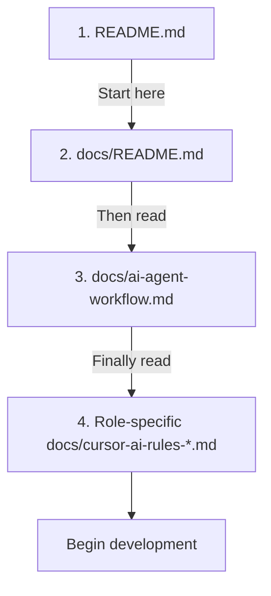
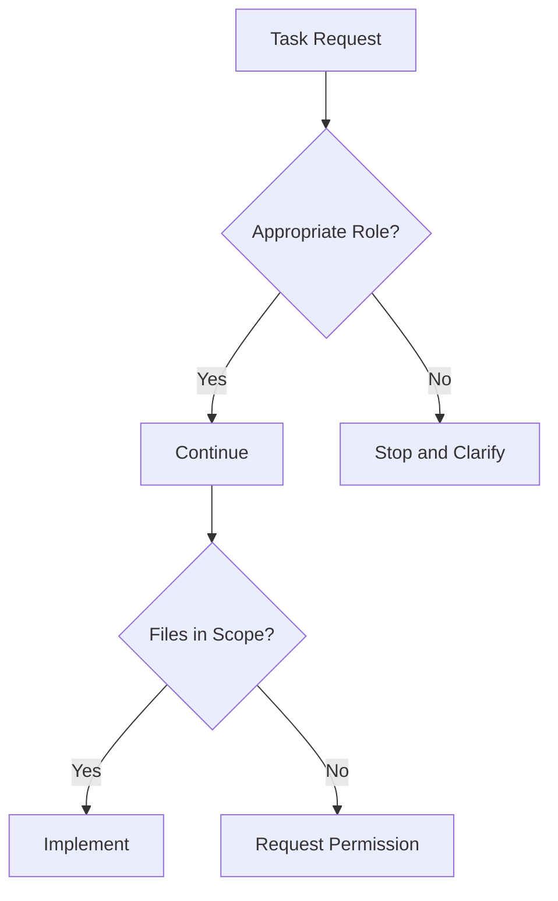
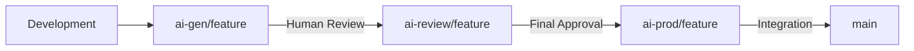

# Getting Started with AI Code Generation in Cursor

All new code is intended to be generated programatically using AI Code Gen Agents to ensure all relevant context docs are created. 

Welcome to this repository! This guide will help you understand how to effectively use Cursor AI with this codebase, which has been specifically structured to facilitate safe and effective collaboration with AI coding assistants.

## Understanding the Repository Structure

This repository uses a structured approach to AI-assisted development with specialized documentation and branch management. Here's what you need to know:

### Documentation Hierarchy

The repository uses a hierarchical documentation approach that both you and the AI assistant should follow:

1. **Top-level README.md** - Provides an overview of the repository and core principles
2. **Documentation directory (`docs/`)** - Contains detailed guidelines and workflow documentation
3. **Role-specific rule files** - Define boundaries for different development domains



### Key Documentation Files

When working with Cursor AI, these files are particularly important:

| File | Purpose |
|------|---------|
| `README.md` | Repository overview and core principles |
| `docs/ai-agent-workflow.md` | Detailed AI assistant workflow |
| `docs/README.md` | Documentation guidelines, especially for AI |
| `docs/cursor-ai-rules-index.md` | Index of role-specific guides |
| `docs/cursor-ai-rules-*.md` | Role-specific constraints (UI, API, etc.) |

## Working with Cursor AI

### Step 1: Set Up Your Environment

1. Clone the repository:
   ```bash
   git clone <repository-url>
   cd <repository-name>
   ```

2. Run the setup script:
   ```bash
   chmod +x scripts/setup-repo.sh
   ./scripts/setup-repo.sh
   ```

3. Open the repository in Cursor IDE

### Step 2: Create a Feature Branch

Use the branch automation script to create a proper AI-specific branch:

```bash
./scripts/branch-automation.sh feature-name
```

This creates an `ai-gen/feature-name` branch where AI-generated code will be isolated.

### Step 3: Instructing Cursor AI

When working with Cursor AI, follow this process:

1. **Determine the role** - Identify which role-specific guide applies to your task (UI, API, Database, etc.)
2. **Instruct the AI** - Use a prompt following this pattern THEN copy the output into the rules of Cursor AI IDE:

```
I need help with [task description].

Before you begin:
1. Please read the repository's README.md to understand the overall structure
2. Then read docs/ai-agent-workflow.md to understand the workflow
3. Follow the role-specific guidelines in docs/cursor-ai-rules-[role].md

I need this to [specific requirements]...
```

This ensures the AI will understand the repository structure and follow the appropriate constraints.

### Step 4: Review AI-Generated Code

After Cursor AI generates code:

1. Review the code for alignment with repository standards
2. Ensure it follows the role-specific constraints
3. Verify it includes necessary tests if required
4. Check for appropriate error handling and security considerations

### Step 5: Promote the Branch

When ready to promote the AI-generated code:

```bash
# Promote to review stage
./scripts/branch-automation.sh feature-name promote-to-review

# After review, promote to production stage
./scripts/branch-automation.sh feature-name promote-to-prod
```

## Understanding the Mermaid Diagrams

This repository uses Mermaid diagrams extensively in documentation. These diagrams:

1. Visualize complex workflows
2. Illustrate component relationships
3. Define role boundaries
4. Provide clear examples of correct vs. incorrect approaches

When instructing Cursor AI, refer to these diagrams to help it understand constraints and expectations.

Example:



## Role-Based Development

This repository separates development into specialized roles to maintain architectural boundaries:

1. **UI Component Developer** - Frontend components and styling
2. **API Developer** - API endpoints and services
3. **Database Schema Developer** - Database schemas and data access
4. **Authentication & Security Specialist** - Security features
5. **Dashboard Developer** - Dashboard components and visualizations

When working on a particular feature, identify which role(s) apply and direct Cursor AI to follow the corresponding rule file.

## Branch Workflow

The repository uses a three-stage branch structure:

1. **ai-gen/** - Initial AI-generated code (development)
2. **ai-review/** - AI code after human review (verification)
3. **ai-prod/** - Production-ready AI code (ready for integration)



Always ensure you're working in the correct branch for your current stage.

## Common Pitfalls to Avoid

1. **Mixing Responsibilities** - Don't let AI generate code outside its assigned role
2. **Bypassing Branch Structure** - Always follow the three-stage branch workflow
3. **Incomplete Documentation Reading** - Ensure AI reads all necessary documentation
4. **Insufficient Context** - Provide clear context and requirements to the AI

## Scientific Background

For a deeper understanding of the framework used in this repository, read the scientific paper:

**[Mermaid-Guided Documentation for AI Code Generation: A Framework for Structured Collaboration in Git Repositories](MermaidGuided_AI_CodeGen_Framework.md)**

This paper explains the theoretical foundation and benefits of the approach implemented here.

## Need Help?

If you encounter any issues:

1. Review the documentation hierarchy again
2. Check if you're following the correct role-specific guidelines
3. Ensure you're using the appropriate branch structure
4. Reference the examples in the documentation

By following these guidelines, you'll be able to effectively collaborate with Cursor AI while maintaining code quality and security standards. 
