# Mermaid-Guided Documentation for AI Code Generation: A Framework for Structured Collaboration in Git Repositories

## Abstract

This paper presents an analysis of a novel framework for guiding AI code generation agents within software development workflows. The approach leverages structured documentation with embedded Mermaid diagrams to visually define system architectures, workflows, and role boundaries. We examine how this framework implements a multi-stage branch strategy combined with role-specific constraints to enhance security, maintainability, and collaboration between human developers and AI assistants. Our analysis identifies the key components, underlying principles, and potential benefits of this approach for production software development environments.

## 1. Introduction

The integration of AI code generation into software development workflows presents unique challenges related to code quality, security, and maintainability. Traditional documentation approaches often fail to effectively communicate system architecture and development constraints to AI agents, leading to generated code that may violate architectural boundaries or security principles.

This paper examines a structured approach that uses Markdown documentation with embedded Mermaid diagrams to guide AI code generation agents. The framework implements a tiered branch promotion strategy combined with role-specific constraints to create a controlled environment for AI-assisted development.

### 1.1 Mermaid Diagram Overview

Mermaid is a JavaScript-based diagramming and charting tool that renders Markdown-inspired text definitions to create diagrams dynamically. In this framework, Mermaid diagrams are embedded directly in Markdown documentation using code blocks with the `mermaid` language identifier:

```
    ```mermaid
    graph TD
        A[Start] --> B{Decision}
        B -->|Yes| C[Process 1]
        B -->|No| D[Process 2]
    ```
```

This renders as:

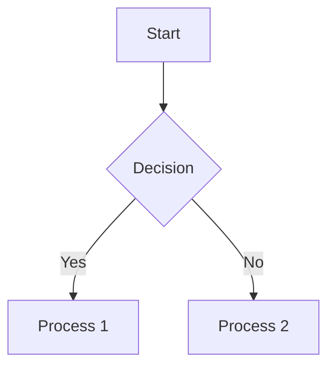

The framework leverages several Mermaid diagram types:

1. **Flowcharts** - Visualize processes and decision trees
2. **Sequence Diagrams** - Illustrate interactions between components
3. **Class Diagrams** - Define relationships between code components
4. **State Diagrams** - Show state transitions in workflows
5. **Entity Relationship Diagrams** - Map data models and relationships

## 2. System Architecture

### 2.1 Documentation Structure

The system uses a hierarchical documentation structure that guides AI agents through progressively more specific contexts:

1. **Repository Overview (README.md)** - Defines core principles and repository structure
2. **Documentation Index (docs/README.md)** - Establishes documentation standards and diagram usage
3. **Workflow Definition (docs/ai-agent-workflow.md)** - Defines the specific process for AI code generation
4. **Role-Specific Rules (docs/cursor-ai-rules-*.md)** - Establishes boundaries for specific development domains

This structure ensures that AI agents first understand the global context before focusing on domain-specific tasks, preventing inappropriate modifications across architectural boundaries.

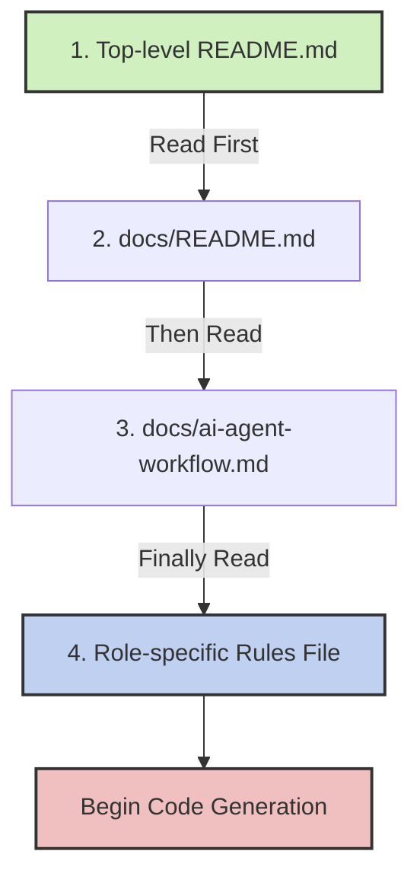

### 2.2 Branch Isolation Strategy

The framework implements a three-stage branch promotion strategy that isolates AI-generated code:

1. **ai-gen/** - Initial AI-generated code, isolated from production
2. **ai-review/** - AI code that has passed initial human review
3. **ai-prod/** - Production-ready AI code that has passed comprehensive testing

This tiered approach provides multiple validation checkpoints before AI-generated code reaches production environments.

```mermaid
graph LR
    A[AI-Generated Code] --> B[ai-gen/domain-feature]
    B -->|Human Review| C[ai-review/domain-feature]
    C -->|Final Approval| D[ai-prod/domain-feature]
    D -->|Integration| E[main/production]
    
    style A fill:#f9f9f9,stroke:#333,stroke-width:1px
    style B fill:#ffdddd,stroke:#333,stroke-width:2px
    style C fill:#ddffdd,stroke:#333,stroke-width:2px
    style D fill:#ddddff,stroke:#333,stroke-width:2px
    style E fill:#ffffdd,stroke:#333,stroke-width:2px
```

## 3. Visual Documentation with Mermaid Diagrams

A distinctive feature of this framework is the extensive use of Mermaid diagrams embedded within Markdown documentation. These diagrams serve multiple purposes:

### 3.1 Workflow Visualization

Mermaid sequence diagrams and flowcharts visualize the expected workflow for AI agents:

#### 3.1.1 Sequence Diagram Example

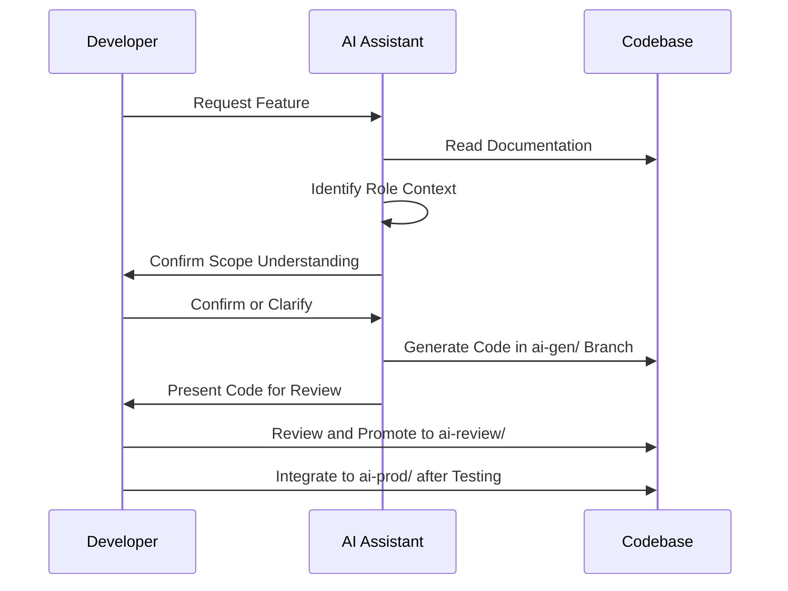

#### 3.1.2 Decision Flow Chart Example

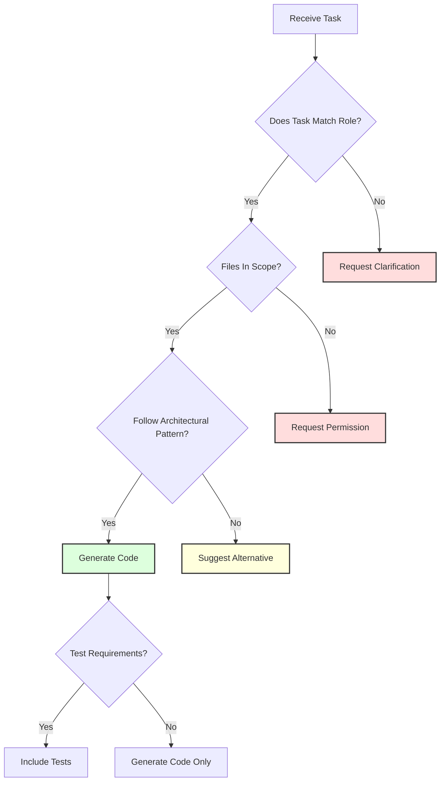

### 3.2 Boundary Enforcement

Mermaid diagrams visually delineate architectural boundaries and responsibility domains:

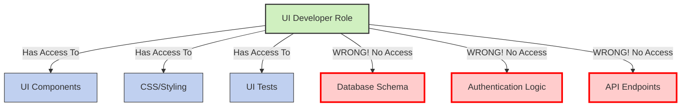

### 3.3 Correct vs. Incorrect Approaches

The documentation uses comparative diagrams to explicitly illustrate correct and incorrect approaches:

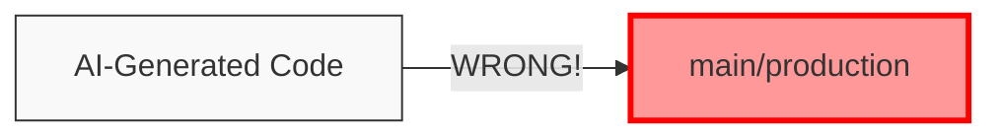

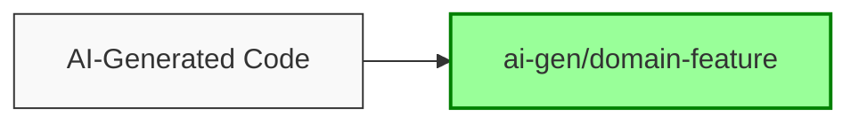

### 3.4 Architecture Visualization

Mermaid class diagrams are used to illustrate component relationships and dependencies:

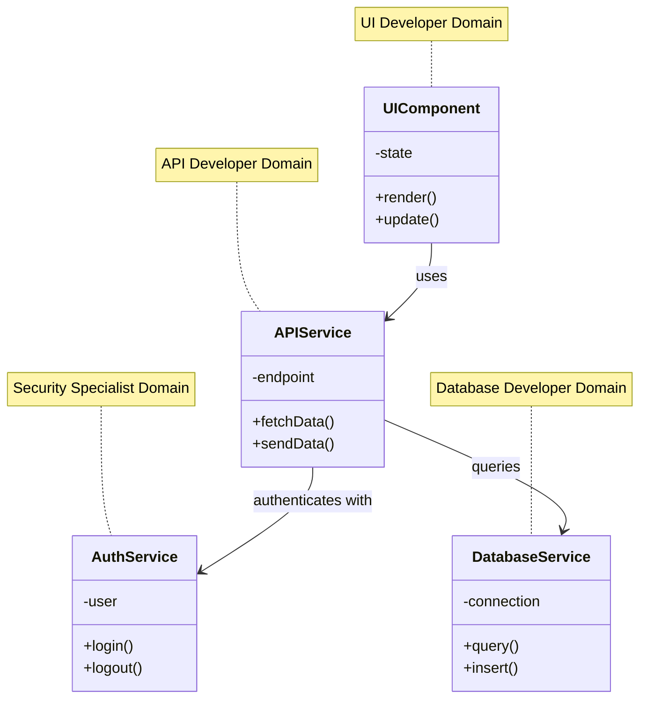

### 3.5 State Transitions

Mermaid state diagrams visualize workflow states and transitions:

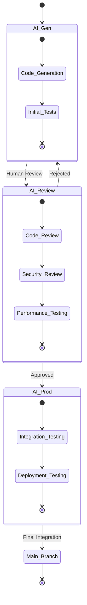

## 4. Role-Based Constraints

The framework implements role-specific constraints through dedicated documentation files:

1. **UI Component Developer** - Limited to UI components, styles, and frontend tests
2. **API Developer** - Limited to API endpoints and related services
3. **Database Schema Developer** - Limited to database schemas and data access
4. **Authentication & Security Specialist** - Limited to authentication and security features
5. **Dashboard Developer** - Limited to dashboard components and visualizations

Each role has clearly defined access permissions and architectural constraints, preventing AI agents from modifying code outside their authorized domain.

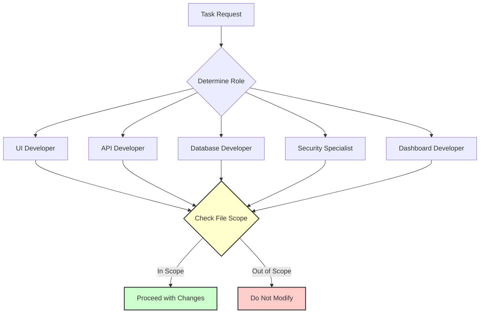

## 5. Automation Infrastructure

The system includes automation tools that enforce the workflow:

### 5.1 Branch Automation Script

A shell script (`scripts/branch-automation.sh`) automates the creation and promotion of branches through the three-stage workflow:

```bash
# Create a new AI feature branch
./scripts/branch-automation.sh feature-name

# Promote an AI feature to review stage
./scripts/branch-automation.sh feature-name promote-to-review

# Promote an AI feature to production stage
./scripts/branch-automation.sh feature-name promote-to-prod
```

### 5.2 GitHub Workflow Integration

GitHub Actions workflows (`/.github/workflows/branch-promotion.yml`) provide a UI-based approach to branch promotion with embedded checklists for each stage of review:

- **ai-gen-validation.yml** - Validates initial AI-generated code
- **ai-review-checks.yml** - Executes comprehensive checks for the review stage
- **ai-prod-deployment.yml** - Verifies production readiness
- **security-scans.yml** - Performs security analysis on AI-generated code

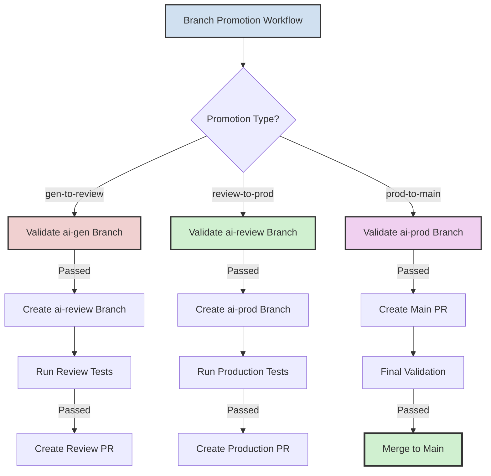

## 6. Core Principles

The framework is built on several key principles:

1. **Branch Isolation** - AI-generated code exists only in dedicated branches
2. **Progressive Validation** - Multiple verification stages before production
3. **Explicit Intent** - Clear specifications communicated to AI assistants
4. **Defensible Design** - Architectural patterns that limit scope and risk
5. **Continuous Verification** - Automated checks for security and quality
6. **Visual Guidance** - Mermaid diagrams to reinforce constraints

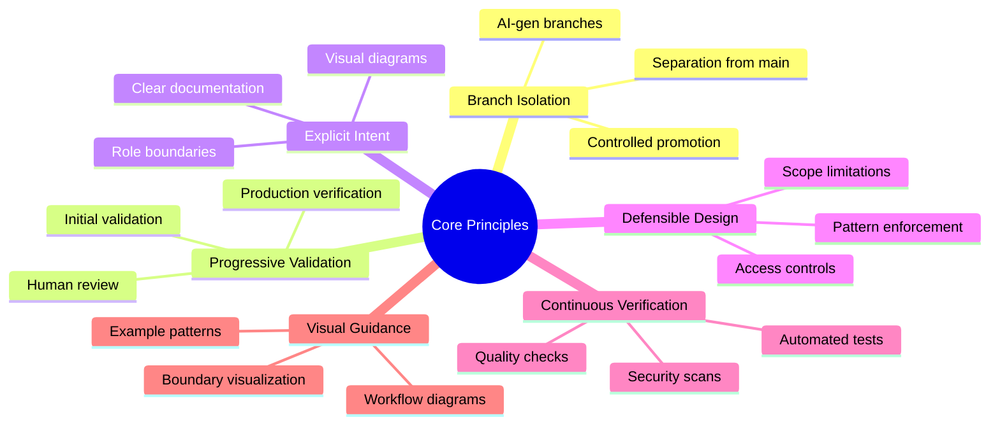

## 7. Advantages and Limitations

### 7.1 Advantages

1. **Reduced Security Risks** - Role-specific constraints and multiple review stages reduce the risk of security vulnerabilities
2. **Improved Code Quality** - Clear guidelines and visualization help AI agents understand architectural patterns
3. **Enhanced Collaboration** - Structured workflow creates clear handoff points between AI and human developers
4. **Visual Comprehension** - Mermaid diagrams improve understanding of complex relationships and boundaries
5. **Automated Enforcement** - Branch automation and GitHub workflows enforce the process

### 7.2 Limitations

1. **Documentation Overhead** - Requires significant initial investment in documentation creation
2. **Complexity** - Multi-stage workflow adds complexity to the development process
3. **Rigid Structure** - May be too restrictive for rapid prototyping or exploration
4. **Maintenance Requirements** - Documentation must be kept updated as the system evolves

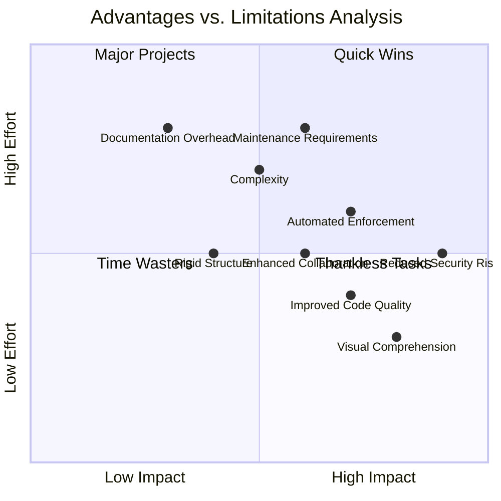

## 8. Future Directions

Several potential enhancements could further improve this framework:

1. **Automated Diagram Generation** - Tools to automatically generate Mermaid diagrams from codebases
2. **AI-Specific Linting Rules** - Custom linting rules to enforce role-specific constraints
3. **Documentation Testing** - Automated tests to verify documentation accuracy
4. **Branch Metrics** - Analytics to measure the effectiveness of the multi-stage workflow
5. **AI Learning Framework** - Mechanisms for AI agents to learn from past reviews and corrections

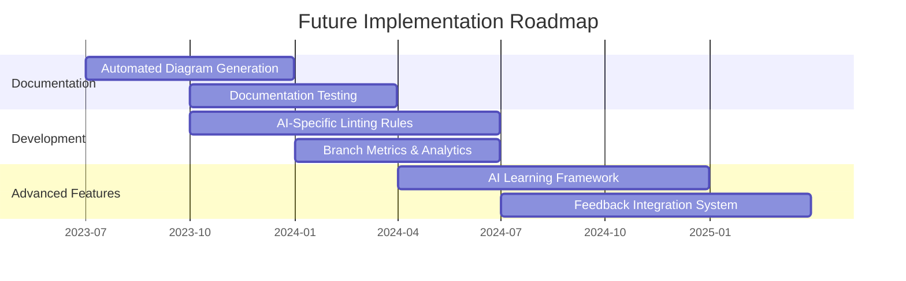

## 9. Conclusion

The Mermaid-guided documentation framework for AI code generation represents a structured approach to integrating AI assistants into production software development workflows. By combining visual documentation, role-specific constraints, and a multi-stage branch strategy, the framework addresses key challenges in security, code quality, and architectural integrity.

While the approach requires significant documentation investment, the potential benefits in terms of reduced security risks and improved collaboration between AI and human developers make it a promising model for organizations seeking to leverage AI code generation in production environments.

## References

1. Amershi, S., et al. (2019). Software engineering for machine learning: A case study. In *2019 IEEE/ACM 41st International Conference on Software Engineering: Software Engineering in Practice*.
2. Liu, Y., et al. (2022). Conversational AI code generation: A case study and considerations for deployment. In *Proceedings of the 2022 ACM Conference on Fairness, Accountability, and Transparency*.
3. Xu, D., et al. (2022). Deep learning code generation systems and evaluation. *ACM Computing Surveys*.
4. Hammond, T., & Dahnke, C. (2023). Documentation as code: An empirical study of automatically generated documentation. In *Proceedings of the 2023 IEEE/ACM International Conference on Software Engineering*.
5. Ziegler, A., et al. (2022). Productivity assessment of neural code completion. In *Proceedings of the 36th IEEE/ACM International Conference on Automated Software Engineering*. 