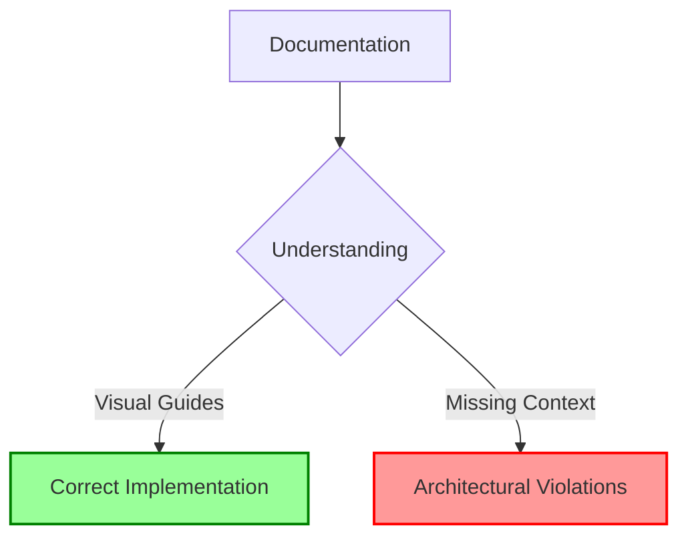

# AI Code Assistant Template

This repository outlines an opinionated approach for safely integrating AI-generated code into production applications. It defines a structured workflow, safety mechanisms, and quality standards for working with AI assistants.

## 📄 Scientific Paper: Mermaid-Guided Documentation Framework

We've published a scientific analysis of our approach in:

**[Mermaid-Guided Documentation for AI Code Generation: A Framework for Structured Collaboration in Git Repositories](MermaidGuided_AI_CodeGen_Framework.md)**

This paper examines how structured documentation with embedded Mermaid diagrams can guide AI code generation agents by:

- Visually communicating system architectures and workflows
- Enforcing role-based access constraints
- Implementing a secure multi-stage branch strategy
- Providing clear examples of correct and incorrect approaches



The framework addresses key challenges in security, code quality, and architectural integrity when integrating AI assistants into development workflows.

## For AI Code Generation Agents

> **Important Instructions for AI Assistants:**
> 
> As an AI Code Generation Agent working with this repository:
> 
> 1. Follow the workflow defined in `docs/ai-agent-workflow.md`
> 2. Adhere to role-specific constraints in `docs/cursor-ai-rules-*.md` files
> 3. Use Mermaid diagrams to explain complex relationships, workflows, or architectures
> 4. Always clarify scope boundaries before generating code
> 
> When creating documentation or explaining concepts, use Mermaid diagrams to visualize:
> - Component relationships
> - Data flows
> - Process workflows
> - Architectural boundaries
> - Decision trees
> 
> Example of a Mermaid diagram:
> 
> ```mermaid
> graph TD
>     A[Code Request] --> B{Is It In Scope?}
>     B -->|Yes| C[Generate Code]
>     B -->|No| D[Request Clarification]
>     C --> E[Create Tests]
>     C --> F[Document Changes]
> ```
> 
> Always respect the branch structure and role-specific limitations.

## Repository Structure

```
.
├── README.md                  # Project overview
├── README-CICD.md             # CI/CD pipeline and quality assurance
├── src/                       # Application source code
│   ├── README.md              # Source code organization
│   ├── components/            # UI components
│   │   └── README.md          # Component design patterns
│   ├── services/              # Business logic and data access
│   │   └── README.md          # Service architecture patterns
│   ├── utils/                 # Shared utilities
│   │   └── README.md          # Utility conventions
│   └── config/                # Configuration
│       └── README.md          # Configuration management
├── tests/                     # Testing infrastructure
│   └── README.md              # Testing guidelines
├── docs/                      # Documentation
│   ├── README.md              # Documentation overview
│   ├── workflows/             # Workflow documentation
│   │   ├── README.md          # AI/human collaboration workflows
│   │   └── branch-automation.md # Branch automation documentation
│   └── security/              # Security guidelines
│       └── README.md          # Security protocols
├── .github/                   # GitHub configurations
│   └── README.md              # GitHub automation guidelines
└── scripts/                   # Automation scripts
    ├── branch-automation.sh   # Branch management script
    └── setup-repo.sh          # Repository setup script
```

## Core Principles

1. **Branch Isolation** - AI-generated code exists only in dedicated branches
2. **Progressive Validation** - Multiple verification stages before production
3. **Explicit Intent** - Clear specifications communicated to AI assistants
4. **Defensible Design** - Architectural patterns that limit scope and risk
5. **Continuous Verification** - Automated checks for security and quality

## Getting Started

### Initial Setup

1. Clone this repository
2. Run the setup script to configure the repository:

```bash
chmod +x scripts/setup-repo.sh
./scripts/setup-repo.sh
```

This will:
- Create necessary directories
- Set up git hooks for enforcing conventions
- Configure branch protection workflows
- Create a sample feature branch

### Branch Workflow

The repository uses a three-stage branch structure for AI-generated code:

1. **ai-gen/** - Initial AI-generated code (development stage)
2. **ai-review/** - AI code after human review (verification stage)
3. **ai-prod/** - Production-ready AI code (production readiness stage)

### Using the Branch Automation

The repository includes a script to manage branch transitions:

```bash
# Create a new AI feature branch
./scripts/branch-automation.sh feature-name

# Promote an AI feature to review stage
./scripts/branch-automation.sh feature-name promote-to-review

# Promote an AI feature to production stage
./scripts/branch-automation.sh feature-name promote-to-prod
```

### GitHub Actions Workflow

For team environments, you can use the GitHub Actions workflow:

1. Navigate to GitHub Actions → Branch Promotion
2. Click "Run workflow"
3. Enter the feature name and select promotion type
4. Click "Run workflow"

## Workflow Documentation

For detailed workflow information, see:

- `README-CICD.md` - CI/CD pipeline details
- `docs/workflows/branch-automation.md` - Branch automation workflow
- `docs/workflows/README.md` - AI/human collaboration patterns

## Technology Stack

This template can be adapted for various technology stacks while maintaining the core safety principles.
