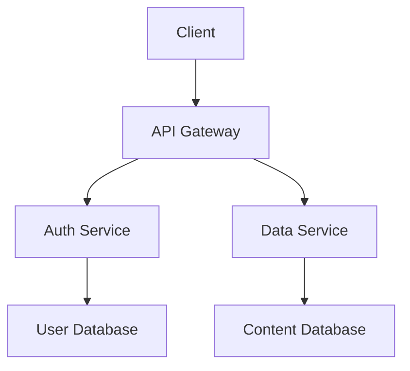

# Documentation

This directory contains project documentation. This README provides an overview of the documentation structure and guidelines for AI assistants.

## Documentation Structure

```
docs/
  ├── README.md                # This overview file
  ├── architecture/            # Architecture documentation
  │   ├── overview.md          # System architecture overview
  │   ├── components.md        # Component architecture
  │   └── data-flow.md         # Data flow diagrams
  ├── security/                # Security documentation
  │   ├── README.md            # Security overview
  │   ├── guidelines.md        # Security implementation guidelines
  │   └── checklist.md         # Security review checklist
  ├── workflows/               # Workflow documentation
  │   ├── README.md            # Workflow overview
  │   ├── ai-collaboration.md  # AI collaboration workflows
  │   └── release-process.md   # Release process workflows
  ├── api/                     # API documentation
  │   ├── overview.md          # API overview
  │   └── endpoints/           # Endpoint documentation
  └── guides/                  # Developer guides
      ├── onboarding.md        # Developer onboarding guide
      ├── best-practices.md    # Development best practices
      └── troubleshooting.md   # Troubleshooting guide
```

## Documentation Guidelines

### 1. Document Structure

Each documentation file should follow a consistent structure:

- **Title** - Clear, descriptive title
- **Overview** - Brief description of the topic
- **Purpose** - Why this information is important
- **Details** - Main content, organized in logical sections
- **Related Resources** - Links to related documentation
- **Examples** - When applicable, provide concrete examples

### 2. Technical Documentation

Technical documentation should include:

- Architecture decisions and rationale
- System components and their relationships
- Data flow diagrams
- API specifications
- Environment setup instructions
- Deployment processes

### 3. Process Documentation

Process documentation should include:

- Step-by-step procedures
- Role responsibilities
- Decision points
- Expected outcomes
- Error handling procedures

### 4. AI Collaboration Documentation

AI collaboration documentation should include:

- Guidelines for working with AI assistants
- Prompt engineering best practices
- Code review processes for AI-generated code
- Security considerations for AI-assisted development
- Documentation templates for AI-related tasks

## Documentation Standards

### 1. Markdown Format

All documentation should use markdown format with consistent styling:

- Use `#` for main headings
- Use `##` for section headings
- Use `###` for subsection headings
- Use bullet points for lists
- Use numbered lists for sequential steps
- Use code blocks with language syntax highlighting

### 2. Diagrams

Include diagrams to illustrate complex concepts:

- Use mermaid.js for sequence diagrams, flowcharts, and entity relationships
- Include both the diagram code and rendered image
- Provide text descriptions for accessibility

Example:



### 3. Code Examples

Include relevant code examples:

- Use syntax highlighting
- Keep examples concise and focused
- Ensure examples follow coding standards
- Include comments for complex sections
- Verify examples are correct and up to date

Example:

```typescript
// Authentication service example
export class AuthService {
  /**
   * Authenticates a user with email and password
   * @param email User's email address
   * @param password User's password
   * @returns Promise with authentication result
   */
  async login(email: string, password: string): Promise<AuthResult> {
    try {
      // Validate inputs
      if (!isValidEmail(email)) {
        return { success: false, error: 'Invalid email format' };
      }
      
      // Authenticate with API
      const response = await this.apiClient.post('/auth/login', {
        email,
        password
      });
      
      // Store authentication token
      if (response.token) {
        localStorage.setItem('auth_token', response.token);
        return { 
          success: true, a
          user: response.user 
        };
      }
      
      return { success: false, error: 'Authentication failed' };
    } catch (error) {
      return { 
        success: false, 
        error: error.message || 'Authentication failed' 
      };
    }
  }
}
```

## Documentation Maintenance

Documentation should be treated as a living artifact:

1. **Update with Code Changes** - Documentation should be updated whenever code changes
2. **Regular Reviews** - Documentation should be reviewed regularly for accuracy
3. **Version Control** - Documentation changes should be tracked in version control
4. **Deprecation Notices** - Add deprecation notices for outdated content

## AI Documentation Guidelines

When AI assistants generate documentation, they should follow these guidelines:

1. **Accuracy** - Information must be accurate and reflect actual implementation
2. **Clarity** - Use clear, concise language
3. **Completeness** - Cover all necessary aspects of the topic
4. **Consistency** - Maintain consistent terminology and style
5. **Examples** - Include practical examples
6. **Security** - Never include sensitive information or secrets
7. **Audience** - Consider the knowledge level of the intended audience

## Documentation and the CI/CD Process

Documentation is integral to the CI/CD process:

- Automated checks for documentation updates with code changes
- Documentation generation as part of the build process
- Documentation deployment alongside application releases
- Documentation feedback mechanisms for continuous improvement 