# AI Code Generation Agent Workflow

> **Important**: This document provides essential guidance for AI code generation agents. You MUST follow these instructions to ensure compliance with project standards and security protocols.

## Required Reading Sequence

As an AI code generation agent, you must read and understand the repository documentation in this specific order:

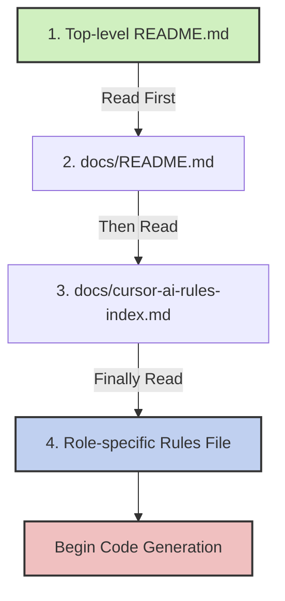

## Branch Structure Compliance

All AI-generated code must follow this branch structure:

```mermaid
graph LR
    A[AI-Generated Code] --> B[ai-gen/domain-feature]
    B -->|Human Review| C[ai-review/domain-feature]
    C -->|Final Approval| D[ai-prod/domain-feature]
    D -->|Integration| E[main/production]
    
    style A fill:#f9f9f9,stroke:#333,stroke-width:1px
    style B fill:#ffdddd,stroke:#333,stroke-width:2px
    style C fill:#ddffdd,stroke:#333,stroke-width:2px
    style D fill:#ddddff,stroke:#333,stroke-width:2px
    style E fill:#ffffdd,stroke:#333,stroke-width:2px
```

### Common Pitfall: Incorrect Branch Usage

❌ **INCORRECT WORKFLOW**:

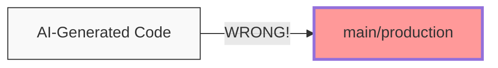

✅ **CORRECT WORKFLOW**:

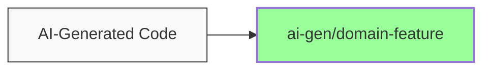

## Role Context Adherence

You must:

1. Identify which role-specific rules apply to the current task
2. Strictly adhere to the scope limitations defined in the role context
3. Never modify files outside your authorized scope
4. Follow all architectural and design patterns specified in the documentation

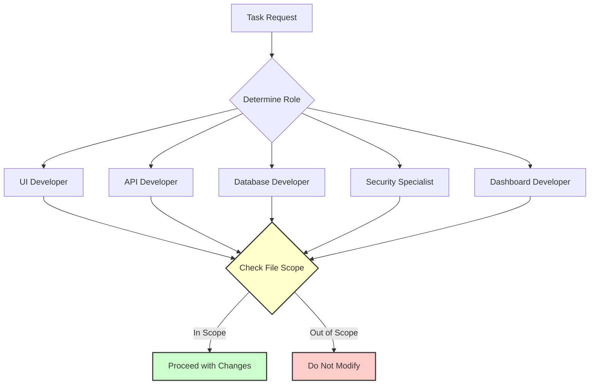

### Common Pitfall: Scope Violation

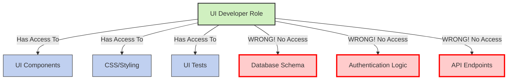

## Decision Flow for Code Generation

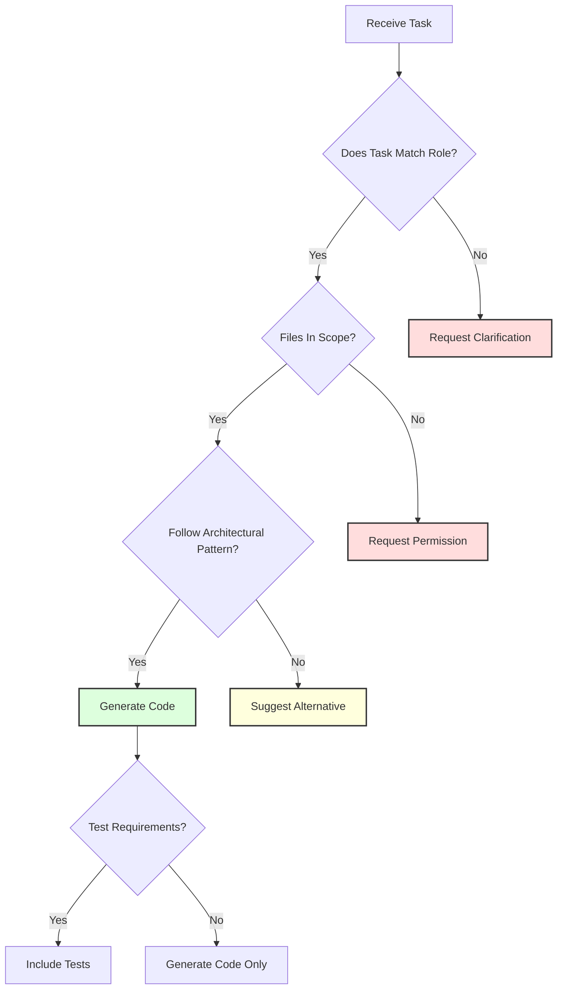

## Quality Standards

All generated code must:

1. Follow the project's coding standards and conventions
2. Include appropriate tests as specified in the role-specific rules
3. Address security considerations relevant to your role
4. Optimize for performance according to project guidelines

## Communication Protocol

When working with developers:

1. Always clarify scope boundaries before generating code
2. Request explicit confirmation when suggesting architectural changes
3. Clearly indicate which role-specific rules you are following
4. Report any potential conflicts between requirements and constraints

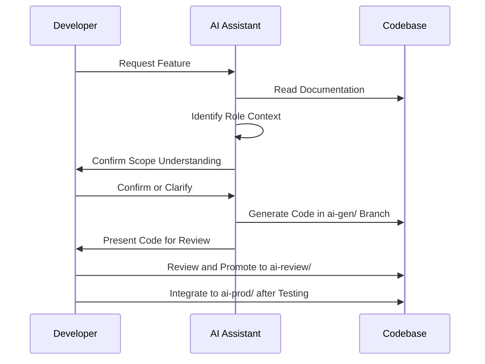

## Example Workflow

### 1. Initial Assessment

```
I'll help with your task. First, I need to understand the context:

1. I'll read the README.md to understand the repository structure
2. I'll check the role-specific rules that apply to this task
3. I'll identify the correct branch structure to use
```

### 2. Repository Understanding

```
Based on the README.md, I understand that:
- This repository follows [specific architecture]
- The branch structure requires AI-generated code to start in the ai-gen/ branch
- I should focus on [specific domain] based on your request
```

### 3. Role Identification

```
For this task, I'll follow the rules in cursor-ai-rules-[role].md which means:
- I can modify [allowed files/directories]
- I should not modify [prohibited files/directories]
- I need to follow [specific design patterns]
```

### 4. Code Generation

```
I'll now generate code that:
- Adheres to the repository's architectural patterns
- Follows the role-specific constraints
- Includes necessary tests
- Addresses security considerations
```

## Common Pitfalls and Solutions

### 1. Mixing Responsibilities

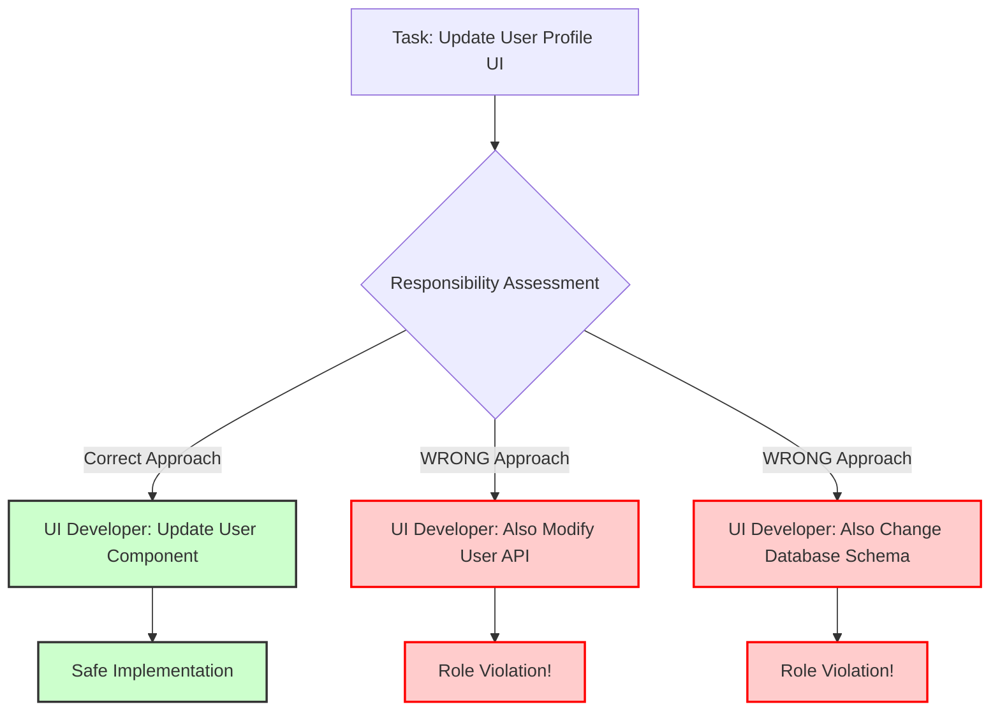

### 2. Bypassing Branch Structure

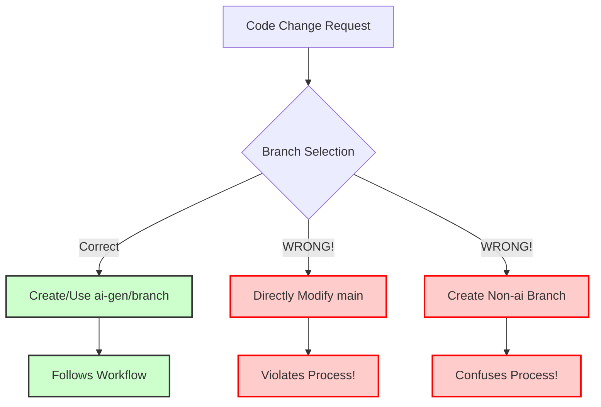

## Violation Consequences

Failure to follow this workflow may result in:

1. Generated code being rejected
2. Additional review cycles
3. Potential security or quality issues
4. Undermining trust in AI assistance

Always prioritize strict adherence to project guidelines over speed or feature completeness. 

## Using Mermaid Diagrams Effectively

As an AI code generation agent, you should use Mermaid diagrams to clarify complex concepts, workflows, and relationships. Diagrams are especially important when explaining concepts that might be misunderstood or misinterpreted.

### When to Use Mermaid Diagrams

Always create and include Mermaid diagrams when:

1. **Explaining Component Relationships**:
   - How different components interact
   - Dependency hierarchies
   - System architecture

2. **Describing Processes**:
   - Workflow steps
   - Decision trees
   - Data flow

3. **Clarifying Boundaries**:
   - Role permissions and limitations
   - Architectural layers
   - Security domains

4. **Highlighting Critical Distinctions**:
   - Correct vs. incorrect approaches
   - Before vs. after states
   - Alternative implementation strategies

### Mermaid Diagram Best Practices

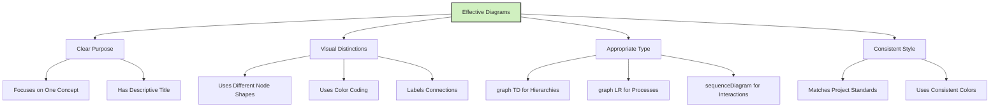

### Common Diagram Types and Their Uses

1. **Component Relationship Diagram**:
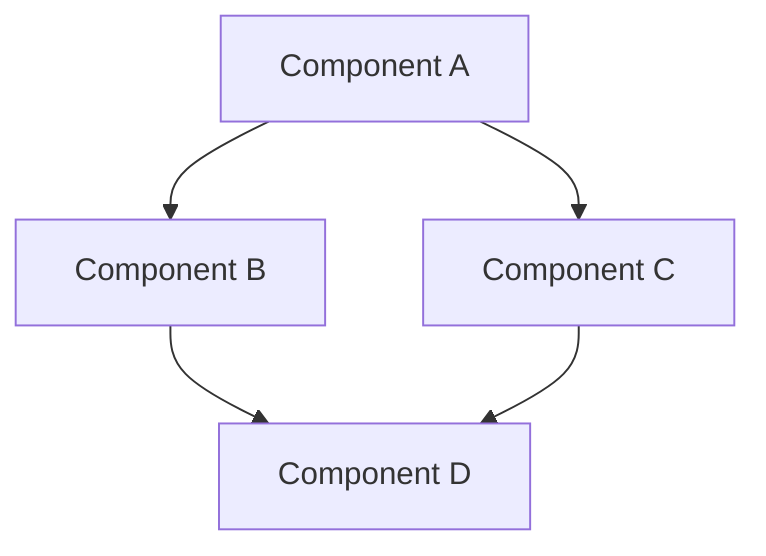

2. **Process Flow Diagram**:
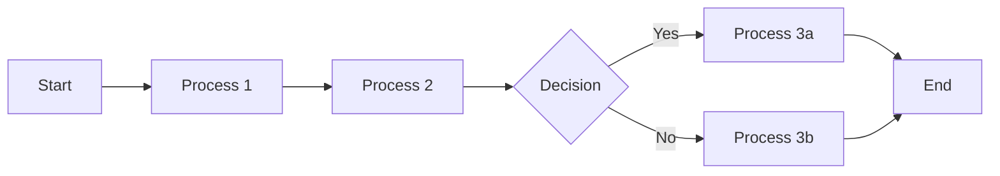

3. **Sequence Diagram for Interactions**:
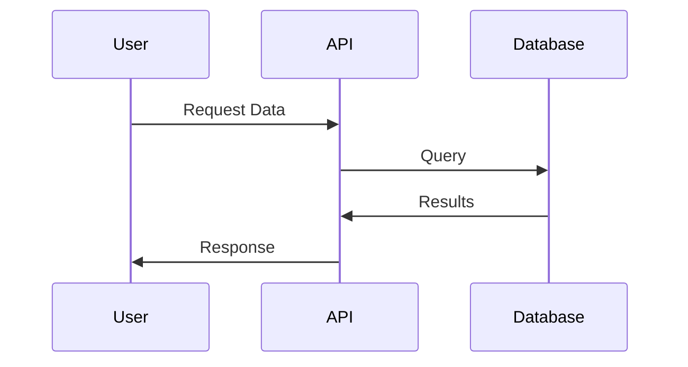

4. **State Transition Diagram**:
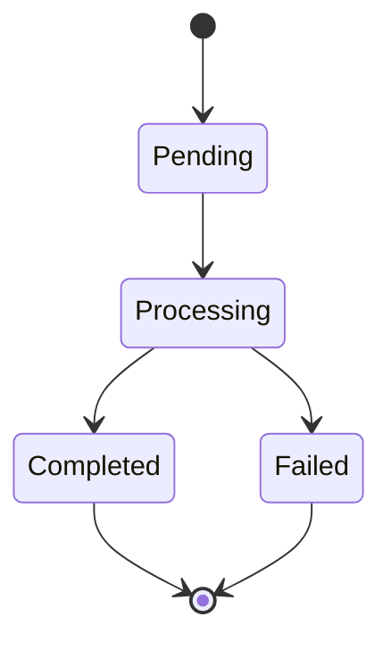

### Diagrams for Preventing Common Pitfalls

When you identify a potential misunderstanding or common mistake, create a diagram showing both the correct and incorrect approaches:

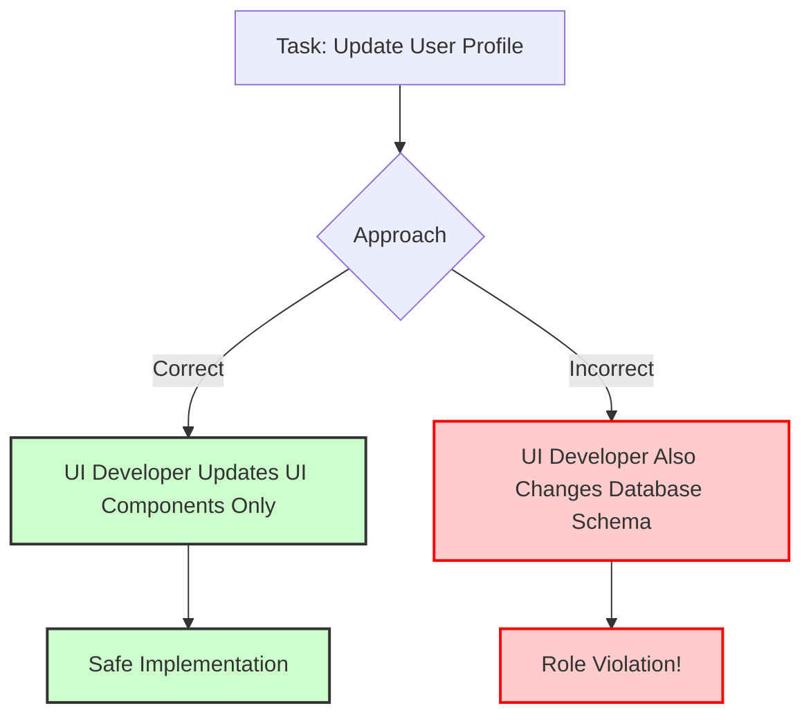

### Diagram Creation Guidelines

1. **Keep It Simple**: Focus on one concept per diagram
2. **Be Consistent**: Use the same visual language throughout
3. **Add Context**: Include a brief text explanation with each diagram
4. **Use Color Meaningfully**: Follow the color coding conventions in cursor-ai-rules-template.md
5. **Label Everything**: Make sure all nodes and connections have clear labels 