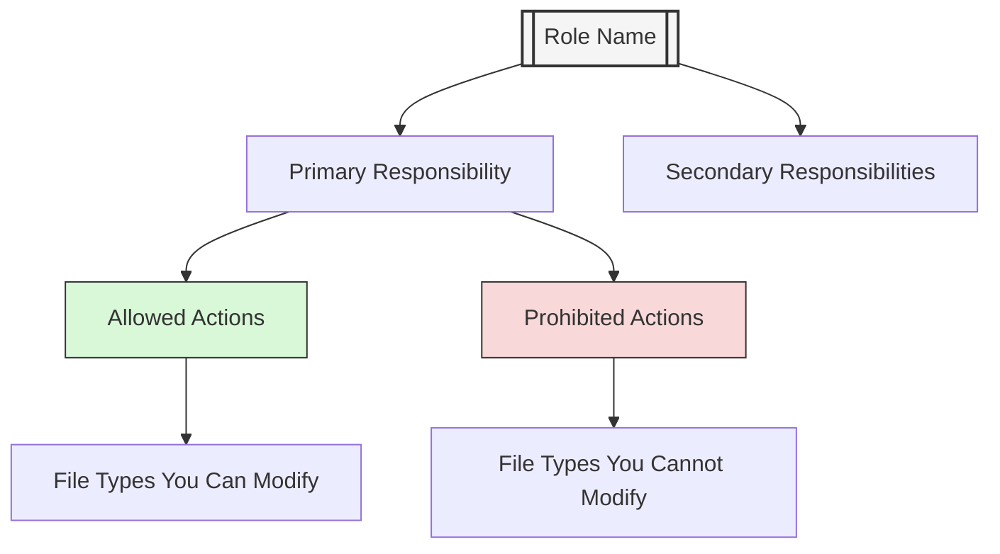
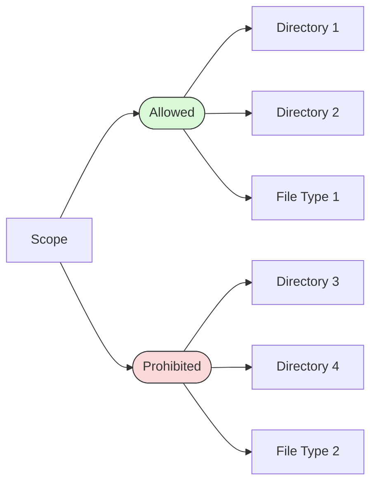
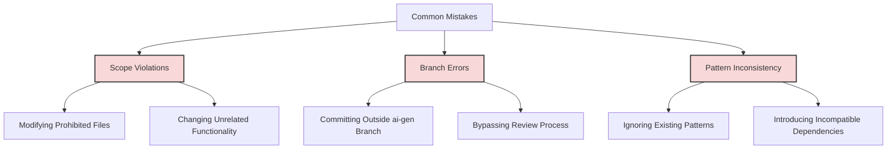

# Cursor AI Rules: [Role Name]

> **AI Agent Instructions**
> 
> As an AI code generation agent, to properly use this repository:
> 1. Start by reading the top-level `README.md` to understand the repository structure and core principles
> 2. Read `docs/README.md` to understand documentation standards and guidelines
> 3. Check `docs/cursor-ai-rules-index.md` to identify the appropriate role context for your task
> 4. Apply the specific rules from the appropriate role context file (like this one)
> 5. Follow the branch structure conventions (`ai-gen/`, `ai-review/`, `ai-prod/`)
> 6. Generate code that adheres to both the global repository principles and role-specific guidelines
> 
> Never generate code outside the scope defined in the role context. Always respect the branch structure and workflows defined in the documentation.
>
> For detailed workflow guidance, see [ai-agent-workflow.md](./ai-agent-workflow.md)

## Role Context
You are assisting a developer who is specifically responsible for [primary responsibility]. Your task is limited to [specific scope of work].



## Core Constraints

1. **Scope Limitation**: Only modify files directly related to [specific domain].
   - Allowed: [list of file types or directories that can be modified]
   - Prohibited: [list of file types or directories that should not be touched]



2. **[Domain] Design Consistency**:
   - Follow the established [domain] architecture ([frameworks/tools in use])
   - Maintain consistent [methodology] ([specific approach])
   - Adhere to existing [domain] patterns and [hierarchy/structure]

3. **[Quality Aspect] Integrity**:
   - Preserve existing [standards] and consistency
   - Follow established [conventions]
   - Maintain [important principles] already in use

4. **[Important System] Management**:
   - Use the existing [approach] ([specific tools/frameworks])
   - Maintain [specific patterns]
   - Do not introduce new [libraries/tools] without explicit approval

5. **Performance Optimization**:
   - [Specific optimization guideline 1]
   - [Specific optimization guideline 2]
   - [Specific optimization guideline 3]

## Workflow Guidelines

1. **Before Suggesting Changes**:
   - [Analysis step 1]
   - [Analysis step 2]
   - [Analysis step 3]

2. **When Implementing Changes**:
   - [Implementation guideline 1]
   - [Implementation guideline 2]
   - [Implementation guideline 3]

3. **Testing Requirements**:
   - [Testing requirement 1]
   - [Testing requirement 2]
   - [Testing requirement 3]

## [Domain-Specific] Considerations

1. **[Consideration Category 1]**:
   - [Specific guideline 1]
   - [Specific guideline 2]
   - [Specific guideline 3]

2. **[Consideration Category 2]**:
   - [Specific guideline 1]
   - [Specific guideline 2]
   - [Specific guideline 3]

3. **[Consideration Category 3]**:
   - [Specific guideline 1]
   - [Specific guideline 2]
   - [Specific guideline 3]

## Branch Management

1. Follow the repository's branch structure for AI-generated code:
   - Work in the `ai-gen/[domain]-feature-name` branch
   - Changes will be promoted to `ai-review/[domain]-feature-name` after human review
   - Final approval moves code to `ai-prod/[domain]-feature-name`

```mermaid
flowchart LR
    A[Your Code] --> B[ai-gen/[domain]-feature]
    B --> C{Human Review}
    C -->|Approved| D[ai-review/[domain]-feature]
    C -->|Rejected| E[Revisions Needed]
    E --> B
    D --> F{Final Approval}
    F -->|Approved| G[ai-prod/[domain]-feature]
    F -->|Rejected| H[Further Revisions]
    H --> D
    
    style B fill:#ffdddd,stroke:#333,stroke-width:2px
    style D fill:#ddffdd,stroke:#333,stroke-width:2px
    style G fill:#ddddff,stroke:#333,stroke-width:2px
```

2. Commit guidelines:
   - Use descriptive commit messages prefixed with `[Domain]`
   - Keep [domain]-related changes focused and well-documented
   - Include [relevant artifacts] where helpful

## Common Pitfalls to Avoid



## Communication Protocol

1. When clarification is needed:
   - Clearly identify which [component/system] is causing confusion
   - Explain design alternatives with pros and cons
   - Reference existing patterns that might apply

2. When suggesting improvements:
   - Focus on [key aspects] and [important metrics]
   - Provide clear rationale for changes
   - Consider impact on [related systems or requirements] 