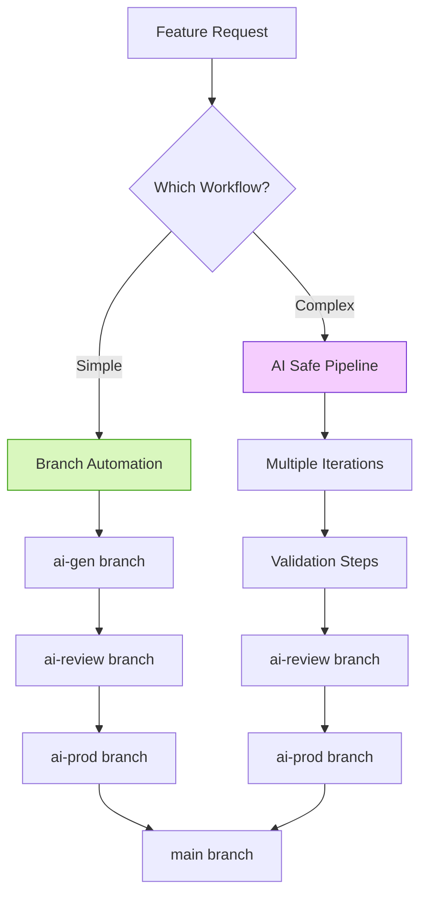
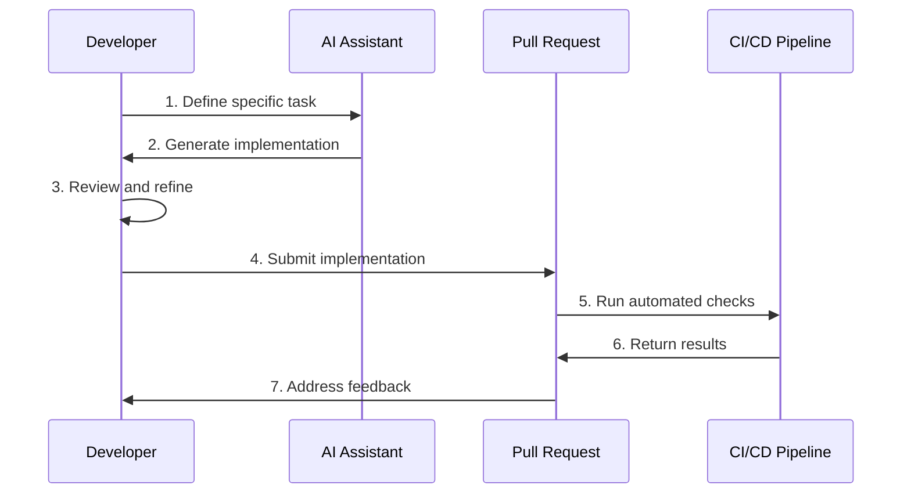
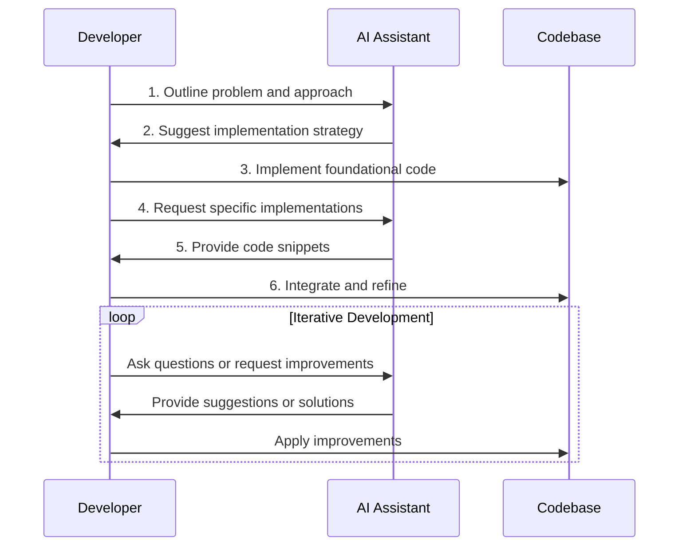
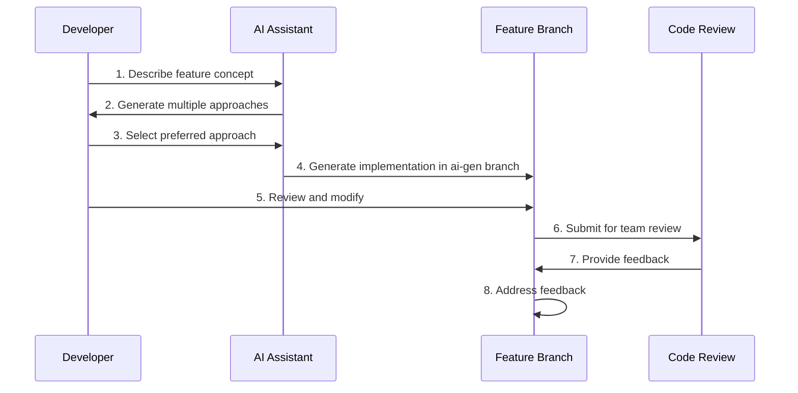

# AI/Human Collaboration Workflows

This directory documents the workflows and processes for AI/human collaboration in this repository.

## Available Workflows

1. **[Branch Automation](branch-automation.md)** - Standard three-stage workflow for AI-generated code
2. **[AI Safe Pipeline](ai-safe-pipeline.md)** - Iterative validation pipeline for safe AI code generation

## Workflow Comparison

| Feature | Branch Automation | AI Safe Pipeline |
|---------|------------------|------------------|
| **Focus** | Simple promotion workflow | Comprehensive validation |
| **Iterations** | Single-pass | Multiple with progressive improvement |
| **Validation** | Manual human review | Automated + optional human review |
| **Branch Structure** | Three stages (gen, review, prod) | Multiple iterations with validation |
| **Best For** | Simple features, experienced teams | Complex features, safety-critical code |

## Choosing a Workflow

- **Use Branch Automation** when:
  - The feature is well-defined and straightforward
  - Human review is readily available
  - Your team has experience with AI-generated code

- **Use AI Safe Pipeline** when:
  - The feature is complex or touches critical systems
  - You need comprehensive automated validation
  - You want iterative improvement of AI-generated code
  - You need detailed reporting on code quality, security, etc.

## Integration between Workflows

The workflows can be used together in a complementary way:

1. Start with the **AI Safe Pipeline** for initial generation and validation
2. Once the pipeline completes successfully, use **Branch Automation** to promote the code through review and production stages

## Common Tools and Scripts

- **[branch-automation.sh](../../scripts/branch-automation.sh)**: Manages the standard three-stage workflow
- **[run-pipeline.sh](../../scripts/ai-pipeline/run-pipeline.sh)**: Runs the AI Safe Pipeline validation system

## Workflow Visualization



# AI Collaboration Workflows

This document outlines the workflows and best practices for collaborating with AI code assistants. It provides guidelines for effective AI-human collaboration in software development.

## Collaboration Models

### 1. Task-Specific AI Assistance



**Best For:**
- Well-defined, isolated features
- Utility functions and helpers
- Boilerplate code generation
- Test case generation

**Process:**
1. Developer defines a specific, bounded task
2. AI generates an implementation
3. Developer reviews, tests, and refines the implementation
4. Implementation is submitted for review
5. Automated checks verify quality and security
6. Implementation is merged after approval

### 2. Pair Programming with AI



**Best For:**
- Complex features requiring domain knowledge
- Architecture planning
- Refactoring existing code
- Performance optimization

**Process:**
1. Developer outlines the problem and approach
2. AI and developer collaborate on implementation strategy
3. Developer implements foundational code
4. AI assists with specific implementation details
5. Developer integrates AI suggestions and refines the solution
6. Iterative refinement through continued collaboration

### 3. AI-Driven Exploration



**Best For:**
- Exploring new libraries or frameworks
- Prototyping features
- Generating starter code for new components
- Evaluating different implementation approaches

**Process:**
1. Developer describes a feature concept
2. AI generates multiple implementation approaches
3. Developer selects preferred approach
4. AI generates implementation in a dedicated branch
5. Developer reviews, tests, and modifies the implementation
6. Team reviews the implementation
7. Feedback is addressed and implementation is refined

## Communication Patterns

### 1. Effective Task Description

A well-structured task description includes:

```
TASK: [Brief description of the task]

CONTEXT:
- [Project context and relevant information]
- [Current codebase structure or patterns]
- [Dependencies and constraints]

REQUIREMENTS:
- [Specific functionality requirements]
- [Performance requirements]
- [Security requirements]
- [Compatibility requirements]

ACCEPTANCE CRITERIA:
- [Criteria for successful implementation]
- [Test requirements]
- [Documentation requirements]

REFERENCES:
- [Links to relevant documentation]
- [Links to similar implementations]
- [Links to related code]
```

### 2. Iterative Refinement

For complex tasks, use iterative refinement:

1. **Outline Phase** - Describe high-level requirements
2. **Structure Phase** - Define component structure and interfaces
3. **Implementation Phase** - Implement specific components
4. **Refinement Phase** - Optimize and improve implementations
5. **Testing Phase** - Add tests and verify functionality

### 3. Feedback and Correction

When providing feedback to AI:

- Be specific about what needs to be changed
- Provide examples of correct implementations
- Explain the reasoning behind the changes
- Reference existing code patterns or documentation

## Branch and Review Workflow

### 1. Branch Naming Convention

```
ai-gen/[feature-name]             # Initial AI-generated code
ai-review/[feature-name]          # Code after human review
ai-prod/[feature-name]            # Production-ready code
```

### 2. Commit Message Format

```
[type]([scope]): [short description]

[detailed description]

[references]
```

Types:
- `feat`: New feature
- `fix`: Bug fix
- `refactor`: Code change that neither fixes a bug nor adds a feature
- `docs`: Documentation changes
- `test`: Adding or updating tests
- `chore`: Changes to build process or auxiliary tools

Example:
```
feat(auth): implement password reset functionality

- Add password reset form component
- Create API endpoint for password reset requests
- Add email service integration for reset links
- Implement token validation logic

References: #123, #456
```

### 3. Review Checklist for AI-Generated Code

Before promoting AI-generated code to `ai-review`:

- [ ] Code follows project conventions and style guidelines
- [ ] All specified requirements are implemented
- [ ] Edge cases are handled appropriately
- [ ] Error handling is comprehensive
- [ ] Security best practices are followed
- [ ] Performance considerations are addressed
- [ ] Tests are included and passing
- [ ] Documentation is complete and accurate

## AI Capability Boundaries

### 1. Tasks Well-Suited for AI

- Implementing well-defined, isolated features
- Generating boilerplate code
- Creating and extending data models
- Implementing standard design patterns
- Writing unit and integration tests
- Creating documentation
- Refactoring existing code
- Implementing UI components from designs

### 2. Tasks Requiring Human Oversight

- System architecture decisions
- Security-critical functionality
- Performance-critical algorithms
- Complex business logic with domain knowledge
- UX design decisions
- Legal compliance implementations
- Infrastructure configuration
- Data privacy implementations

### 3. Tasks Not Suitable for AI

- Authentication and authorization core logic
- Payment processing and financial transactions
- Sensitive data handling
- Critical security functions
- Infrastructure provisioning and deployment
- Third-party integrations with limited documentation

## Quality Assurance

### 1. Automated Checks

All AI-generated code must pass:

- Linting and style checks
- Type checking
- Unit and integration tests
- Security scanning
- Performance benchmarks

### 2. Manual Review Focus Areas

When reviewing AI-generated code, focus on:

- Architectural integrity and consistency
- Business logic correctness
- Edge case handling
- Security implications
- Performance considerations
- Maintainability and readability

### 3. Documentation Requirements

AI-generated code should include:

- Function/component-level documentation
- Usage examples
- Edge case handling explanations
- Performance considerations
- Integration guidelines

## Continuous Improvement

### 1. AI Prompt Library

Maintain a library of effective prompts for common tasks:

- Feature implementation prompts
- Testing prompts
- Refactoring prompts
- Documentation prompts

### 2. Feedback Collection

Collect feedback on AI-generated code:

- Quality and correctness
- Performance and efficiency
- Security and reliability
- Maintainability and readability

### 3. Knowledge Sharing

Share effective AI collaboration practices:

- Regular team sharing sessions
- Documentation of effective prompts
- Case studies of successful AI collaborations
- Lessons learned from challenges 