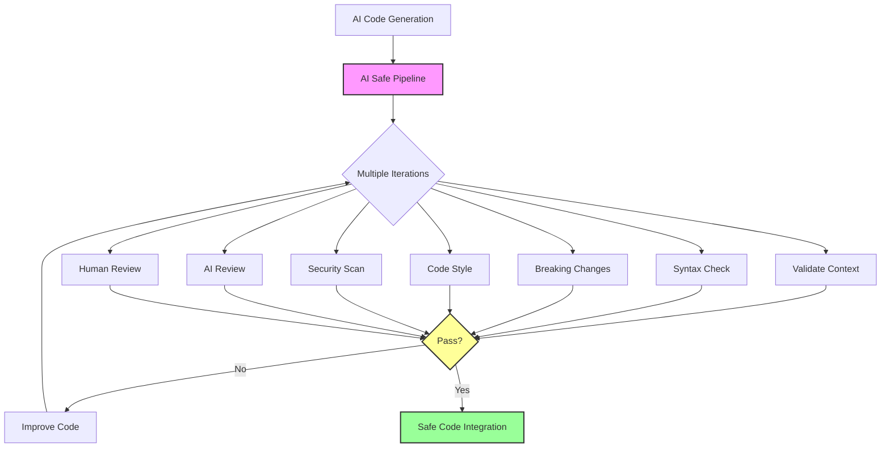

# AI Safe Pipeline System

This document describes the AI Safe Pipeline system, which enables safe code generation and validation with AI agents.



## Overview

The AI Safe Pipeline is a multi-stage validation system that enables AI agents to safely generate and validate code through iterative improvements. The pipeline consists of multiple checks that run on AI-generated code, identifying issues that need to be fixed before the code can be integrated into the main codebase.

## Key Features

- **Iterative Process**: Runs multiple iterations with automatic improvements until stopping conditions are met
- **Comprehensive Validation**: Checks for syntax errors, breaking changes, code style, security issues, and more
- **Progressive Improvement**: Issues found in each iteration are fixed in subsequent iterations
- **AI + Human Collaboration**: Combines AI-driven checks with optional human review
- **Configurable Pipeline**: Flexible configuration of which checks to run and their parameters

## Pipeline Steps

The pipeline includes the following validation steps:

1. **Context Validation**: Ensures the AI understands the context of the code it's generating
2. **Syntax Check**: Verifies that the generated code is syntactically correct
3. **Breaking Changes Detection**: Identifies if changes would break existing functionality
4. **Code Style Verification**: Checks if code adheres to project coding standards
5. **Security Scan**: Looks for potential security vulnerabilities
6. **AI Code Review**: A secondary AI reviews the generated code
7. **Human Review**: Optional human review for final validation

Each step generates detailed reports and identifies issues that should be addressed in subsequent iterations.

## How It Works

### Configuration

The pipeline is configured via a JSON file at `config/ai-pipeline.json`, which defines:

- Minimum and maximum steps to run
- Stopping conditions
- Step details (script location, timeout, required status)
- Repository rules and language-specific guidelines

### Workflow

1. **Initialization**: The pipeline starts with AI-generated code in a branch
2. **Iteration**: For each iteration:
   - A subset of validation steps are run
   - Results are collected and issues identified
   - If stopping conditions aren't met, another iteration starts
3. **Completion**: When stopping conditions are met or maximum iterations reached, the pipeline completes

### Stopping Conditions

The pipeline stops when one of these conditions is met:

- No errors found in the last iteration
- Maximum number of iterations reached
- Human approval received

## Using the Pipeline

### Running the Pipeline

```bash
# Basic usage
./scripts/ai-pipeline/run-pipeline.sh --branch=ai-feature-branch --feature=my-feature

# With custom iterations
./scripts/ai-pipeline/run-pipeline.sh --branch=ai-feature-branch --feature=my-feature --max-iterations=5

# With debug output
./scripts/ai-pipeline/run-pipeline.sh --branch=ai-feature-branch --feature=my-feature --debug
```

### Viewing Results

Results are stored in the `.ai-pipeline-iterations` directory, with subdirectories for each iteration and step. Key files include:

- `summary.txt`: Brief summary of step results
- `*.json`: Detailed results in structured format
- `*.md`: Human-readable reports

### Interpreting Reports

Each step generates its own report format, but generally includes:

- Overview of files checked
- Issues found categorized by severity
- Recommendations for fixing issues
- Summary statistics

## Integration with Repository Workflow

The AI Safe Pipeline integrates with the repository's existing branch workflow:

1. AI code is generated in a feature branch
2. The pipeline runs to validate and improve the code
3. After successful completion, code is ready for traditional review
4. Code is merged into the main branch using standard processes

## Customizing the Pipeline

### Adding New Validation Steps

1. Create a new validation script in `scripts/ai-pipeline/`
2. Add the step to the `config/ai-pipeline.json` file
3. The script should accept standard parameters and return 0 on success

### Modifying Validation Criteria

Edit the `config/ai-pipeline.json` file to update:

- Repository rules
- Language-specific guidelines
- Step parameters (timeout, required status)

### Creating Custom Stopping Conditions

Modify the `check_stopping_conditions` function in `scripts/ai-pipeline/run-pipeline.sh` to add custom logic for when to stop iterations.

## Troubleshooting

### Common Issues

- **Pipeline Step Timeouts**: Increase the timeout in the configuration file
- **Missing Dependencies**: Ensure tools like jq are installed
- **Script Permission Errors**: Ensure all scripts are executable with `chmod +x`

### Logs and Debugging

Use the `--debug` flag to enable verbose output during pipeline execution. All logs are stored in the `.ai-pipeline-iterations` directory.

## Security Considerations

The AI Safe Pipeline is designed with security in mind:

- Isolates AI-generated code in feature branches until validated
- Performs dedicated security scanning
- Reviews code before integration
- Validates against repository-specific security rules

However, it's important to note that no automated system can catch all potential issues, and human oversight is still recommended for critical code. 