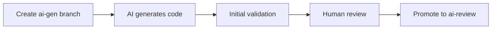
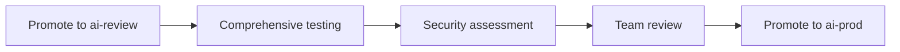
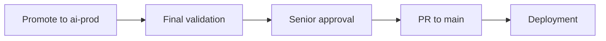

# Branch Automation Workflow

This document explains the automated branch management workflow for safely integrating AI-generated code into production.

## Overview

The branch automation workflow provides a streamlined process for:

1. Creating isolated branches for AI-generated code
2. Promoting code through validation stages
3. Managing pull requests with appropriate checks
4. Ensuring code quality and security at each stage

## Branch Structure

The workflow uses a three-stage branch structure:

- `ai-gen/*` - Initial AI-generated code (development stage)
- `ai-review/*` - AI code after human review (verification stage)
- `ai-prod/*` - Production-ready AI code (production readiness stage)

## Automation Tools

### CLI Script

The repository includes a command-line script for local branch management:

```bash
# Create a new AI feature branch
./scripts/branch-automation.sh my-feature-name

# Promote an AI feature to review stage
./scripts/branch-automation.sh my-feature-name promote-to-review

# Promote an AI feature to production stage
./scripts/branch-automation.sh my-feature-name promote-to-prod
```

### GitHub Action Workflow

For team environments, a GitHub Actions workflow automates branch promotions:

1. Navigate to Actions → Branch Promotion
2. Click "Run workflow"
3. Enter the feature name and select promotion type

## Workflow Stages

### 1. AI Development Stage



**Process:**
1. Developer creates a new `ai-gen/feature-name` branch
2. AI assistant generates code in the isolated branch
3. Initial automated checks run (linting, basic security)
4. Developer reviews and requests changes if needed
5. When satisfied, code is promoted to review stage

### 2. Verification Stage



**Process:**
1. Code is promoted to `ai-review/feature-name` branch
2. Comprehensive automated checks run
3. Team reviews code for quality and security
4. When approved, code is promoted to production stage

### 3. Production Readiness Stage



**Process:**
1. Code is promoted to `ai-prod/feature-name` branch
2. Final validation checks run
3. Senior developer approval required
4. Pull request to main branch created
5. After approval, merged into main and deployed

## Automated Checks

Each stage includes progressively more rigorous automated checks:

| Check Type | AI-Gen | AI-Review | AI-Prod |
|------------|--------|-----------|---------|
| Linting | ✅ | ✅ | ✅ |
| Unit Tests | ✅ | ✅ | ✅ |
| Integration Tests | ❌ | ✅ | ✅ |
| E2E Tests | ❌ | ✅ | ✅ |
| Security Scan | Basic | Advanced | Advanced |
| Performance | ❌ | ✅ | ✅ |
| Documentation | ❌ | ✅ | ✅ |

## Usage Examples

### Example 1: Creating a New Feature

```bash
# Create a new AI feature branch
./scripts/branch-automation.sh user-authentication

# Work with AI to generate code
# ...

# Promote to review stage when ready
./scripts/branch-automation.sh user-authentication promote-to-review
```

### Example 2: Using GitHub Actions for Promotion

1. Go to GitHub Actions → Branch Promotion
2. Click "Run workflow"
3. Enter feature name: "user-authentication"
4. Select promotion type: "review-to-prod"
5. Click "Run workflow"

## Troubleshooting

**Issue**: Promotion fails due to failing checks
- Review the workflow logs to identify failing checks
- Fix issues in the current branch
- Re-run promotion

**Issue**: Conflicts during promotion
- Manually resolve conflicts
- Commit changes
- Re-run promotion

## Best Practices

1. Always create a new AI feature branch for isolated development
2. Address all automated check failures before promotion
3. Follow code review guidelines in docs/workflows/code-review.md
4. Use descriptive feature names for better traceability
5. Update documentation as needed during development 