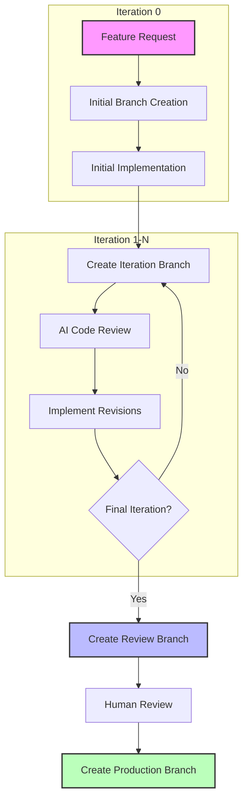

# Iterative AI Code Generation & Review Process

This document outlines the iterative AI code generation and review process implemented in this repository. This approach enables progressive refinement of AI-generated code through multiple focused iterations, each addressing specific aspects of code quality.



## Process Overview

The iterative AI code generation process follows these steps:

1. **Initial Setup (Iteration 0)**
   - Create feature branch `ai-gen/feature-name/iteration-0`
   - Document feature requirements
   - Implement initial functionality

2. **Review & Refinement Iterations (1 to N)**
   - For each iteration:
     - Create iteration branch `ai-gen/feature-name/iteration-X`
     - AI performs focused code review
     - Implement recommended changes

3. **Final Stages**
   - Create review branch `ai-review/feature-name`
   - Human review of the final iteration
   - Create production branch `ai-prod/feature-name`
   - Integration into main codebase

## Review Focus by Iteration

Each iteration focuses on specific aspects of code quality:

1. **Iteration 1: Core Functionality**
   - Ensures the code correctly implements requested functionality
   - Verifies all basic use cases are handled
   - Checks for appropriate error handling

2. **Iteration 2: Code Quality & Style**
   - Adherence to project code conventions
   - Use of appropriate design patterns
   - Clear naming and comprehensive documentation

3. **Iteration 3: Security**
   - Input validation and authentication
   - Protection against vulnerabilities
   - Secure handling of sensitive information

4. **Iteration 4: Performance** (optional)
   - Algorithm efficiency
   - Resource management
   - Query optimization

5. **Iteration 5: Edge Cases & Resilience** (optional)
   - Handling of boundary conditions
   - Graceful degradation
   - Comprehensive test coverage

## Using the Iterative Workflow

### Setup: Creating a New Feature with Multiple Iterations

```bash
# Create a new feature with 3 iterations
./scripts/ai-iterative-branch.sh feature-name 3 docs/code-requirements/iterative-review-criteria.md
```

This command:
- Creates the initial iteration branch `ai-gen/feature-name/iteration-0`
- Sets up documentation structure for tracking iterations
- Copies requirements from the specified file

### Iterating: Create Next Iteration Branch

After completing work on an iteration branch:

```bash
# Create next iteration branch (e.g., iteration 1)
./scripts/ai-iterative-branch.sh feature-name 3 iterate 1
```

This command:
- Creates a new branch `ai-gen/feature-name/iteration-1` based on the previous iteration
- Updates tracking documentation

### Review: Generate AI Review Report

To manually generate a review report for an iteration:

```bash
# Generate review report for iteration 1
./scripts/ai-review-automation.sh feature-name 1
```

This command:
- Creates a review report template based on the iteration's focus
- Prepares diff information for review
- Sets up the structure for AI review comments

### Finalization: Create Review Branch

After completing all iterations:

```bash
# Finalize and create review branch
./scripts/ai-iterative-branch.sh feature-name 3 finalize
```

This command:
- Creates the human review branch `ai-review/feature-name`
- Updates documentation to indicate completion of all iterations

## Automated CI/CD Process

The repository includes GitHub Actions workflows that automate the iterative review process:

1. **Automated Reviews**
   - Triggered on push to iteration branches
   - AI performs code review focused on the iteration's specific concerns
   - Commits review results to the branch

2. **Automated Branch Creation**
   - Can automatically create the next iteration branch after successful review
   - Option can be enabled with the `auto_proceed` parameter

3. **Manual Trigger**
   - Review process can be manually triggered through GitHub Actions
   - Supports specification of feature name, iteration number, and auto-proceed option

## Review Reports

Each iteration produces a structured review report with:

1. **Summary of findings**
   - Key strengths and issues
   - Code metrics

2. **Detailed analysis**
   - Focused on the iteration's main concerns
   - Specific recommendations for improvements

3. **Tracked changes**
   - Summary of changes made in the iteration
   - Architectural decisions and their justification

## Customizing the Process

The number of iterations and review focus can be customized:

- Modify `docs/code-requirements/iterative-review-criteria.md` to change review criteria
- Adjust the template in `docs/code-requirements/review-report-template.md`
- Update `scripts/ai-review-automation.sh` to change the focus for specific iterations

## Integration with Existing Workflow

The iterative workflow integrates with the standard three-stage workflow:

1. Multiple `ai-gen/feature-name/iteration-X` branches replace the single `ai-gen/feature-name` branch
2. Final iteration flows into the standard `ai-review/feature-name` branch
3. After human review, code is promoted to `ai-prod/feature-name` using the standard process 